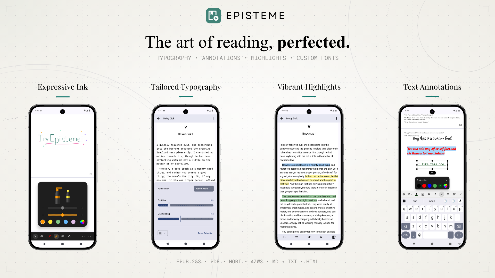

<div align="center">

  <h1>
     
    &nbsp;Episteme Reader
  </h1>

  <p>A native Android document reader application built with Kotlin and Jetpack Compose.</p>

  <a href="https://play.google.com/store/apps/details?id=com.aryan.reader">
      
  </a>

</div>

<br/>



## Overview

Episteme Reader is an offline-first application designed for reading various document formats. It leverages native Android technologies and C++ libraries to provide a performant reading experience with customization capabilities.

> **Note:** This is the Open Source (OSS) edition of Episteme Reader. The version available on the Google Play Store is built from this core but includes additional proprietary features.

## Features

### Supported Formats
*   **Documents:** PDF
*   **E-books:** EPUB, MOBI, AZW3
*   **Text:** MD, TXT, HTML

### PDF Features
*   **Viewing Modes:** Vertical Scroll and Paginated view.
*   **Ink Annotations:** Draw directly on pages using Pen, Highlighter, and Eraser tools.
*   **Text Annotations:** Add text notes anywhere on the page using system or custom fonts.

### E-Book Features
*   **Parsing:** Native parsing for MOBI/AZW3 via `libmobi` and EPUB via `Jsoup`.
*   **Customization:** Adjust font size, line spacing, and margins.
*   **Custom Fonts:** Support for importing user-provided font files (`.ttf`, `.otf`).

### General
*   **Text-to-Speech (TTS):** Read documents aloud using the system TTS engine.
*   **File Management:** Built-in library organization.

## Architecture

*   **UI:** 100% Jetpack Compose (Material3).
*   **Architecture:** MVVM with Unidirectional Data Flow.
*   **Database:** Room (SQLite) for metadata and annotations.
*   **PDF Engine:** `pdfium-android` (Native PDFium bindings).
*   **EPUB Engine:** Utilizes standard `WebView` for vertical scrolling mode, and a custom rendering engine for paginated mode.
*   **Mobi Engine:** Custom JNI bindings to `libmobi`.

## Building from Source

1.  **Clone the repository:**
    ```bash
    git clone https://github.com/Aryan-Raj3112/episteme.git
    cd episteme
    ```

2.  **Build:**
    Open in Android Studio and run the `ossDebug` variant.
    ```bash
    ./gradlew assembleOssDebug
    ```

## Open Source Libraries

This project is made possible by the Android open-source ecosystem:

*   **Core & UI:** AndroidX, Jetpack Compose, Kotlinx Serialization
*   **Document Engines:** PdfiumAndroidKt (PDF), libmobi (MOBI/AZW3), Google WOFF2 (Fonts)
*   **Parsers:** Jsoup (HTML/EPUB), Flexmark (Markdown)
*   **Media & Image Loading:** Coil, Media3 (ExoPlayer)
*   **Utilities:** Room (Database), Timber (Logging)

## License

This project is licensed under the **GNU Affero General Public License v3.0 (AGPL-3.0)**. See the [LICENSE](LICENSE) file for details.